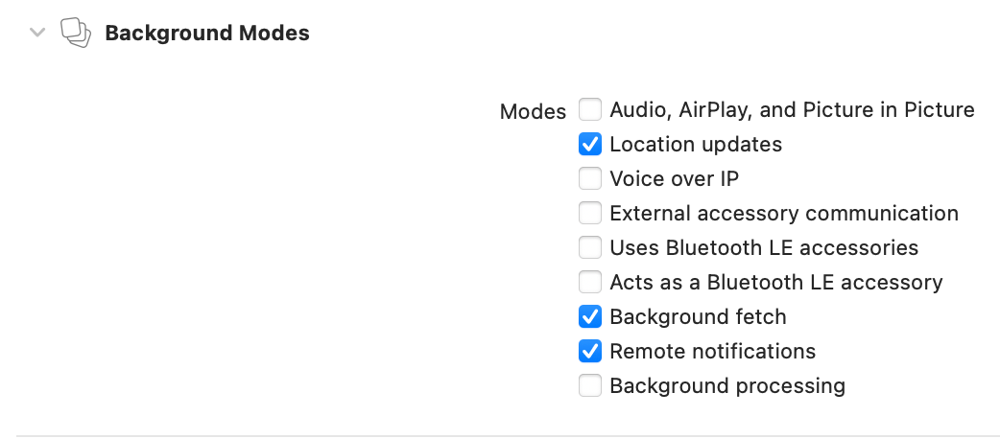

# Kasko2go Open source for iOS

Open source solution SDK for iOS description consists of the following components:
- Steps to start an Open source project;
- Steps fоr integrating the Open source into your solutions;
- Description of interaction with the Open source solution APIs to obtain scoring data;
- Onboarding and main screens for iOS.

<br/>

## Steps to start an Open source project

To work with the Open source project you need to receive the access to our repositories on [Github][git] that contain source codes and technical documentation of the project.
Provide our [Technical Support Service][TSS] with the information about your Github user account ([Github][git] e-mail address) and receive the following access parameters:
- USER - account username;
- PASSWORD - user account password;
- NAVIGATOR_URL - navigation service address URL. 


<br/>

### Telematic data

1. Find the `APIRequestManager` file in the source code repository. Add the lines with access parameters received from out Technical Support Service to the end of the `APIRequestManager` file:
```
prodURL = “https://scoring-api.kasko2go.net/”
2username = “<user_name>”
3password = “<user_password>”
4tripsURL = “<https://navigation_url.host.com/>”
```

2. Find the `DataSender` file in the source code repository. Add the lines with parameters received from out [Technical Support Service][TSS] to the end of the `DataSender` file:
```
sendHost = “receiver.kasko2go.net”
```


### Cartography service
To work with Google autocomplete service receive an **API key for the Maps SDK for iOS**. The procedure for receiving the key is described in [Using API Keys][UAPIK_iOS].
Specify the received Google **API key for the Maps SDK for iOS** in `SearchAddressViewController` file in the following form:
```
override func viewDidLoad() {
    super.viewDidLoad()
 GMSPlacesClient.provideAPIKey(“<api_key>“) 
}
```

### Firebase services

Provide interaction of your iOS application with Firebase services. For this add the `GoogleService-Info.plist` configuration file to your mobile application. Follow [this link][FB_iOS] for the procedure of adding the `GoogleService-Info.plist` configuration file to your mobile application. 

<br/>

## Steps fоr integrating the Open source into your solutions
To integrate the Open source solution SDK into your new project, you need to perform the following steps after contacting our [Technical Support Service][TSS]: 
1. Add framework to project <br/>
Download from the repository and add to your new project, for example into IDE Xcode, our framework `SDKScoring.framework`; if needed, set the flag “Copy items if needed“.  <br/>
While configuring IDE Xcode, perform the following steps:
- Set the value Embed & Sign in the General section for the framework `SDKScoring.framework`

 

- In the Build Phases section add `SDKScoring.framework` into Embed Frameworks subsection

 

- In the Build Phases section add `SDKScoring.framework` into Link Binary With Libraries subsection.

 


2. Add necessary permissions <br/>
Add  necessary permissions to your new project and ask a smartphone user to allow these permissions:
- geolocation service (requestAlwaysAuthorization)
- physical activity sensor (queryActivityStarting). 
To obtain the appropriate access rights, add the following strings to the settings file of your project Info.plist:
```
<key>NSLocationAlwaysAndWhenInUseUsageDescription</key>
<string>We use Location services to rate your driving</string>
<key>NSLocationAlwaysUsageDescription</key>
<string>We use Location services to rate your driving</string>
<key>NSLocationWhenInUseUsageDescription</key>
<string>We use Location services to rate your driving</string>
<key>NSMotionUsageDescription</key>
<string>We only use motion data to rate your driving.</string>
```


3. Background processes <br/>
Allow mobile application operation in the iOS background; to do this, set flags Location updates and Background fetch for Background Modes in the Signing & Capabilities section in IDE Xcode.

 


4. SDK configuration <br/>
To implement SDK into the required classes of your project perform: import SDKScoring.
Interaction with SDK should be done through:  public class - ScoringUserBehaviourObserver.
SDK configuration is done using the following methods. <br/>
Declaration: ``` ScoringUserBehaviourObserver.shared.setup(with userID: String, vehicleID: String, deviceID: String, isBluetoothOn: Bool, settingsArray: [[String : Any]]?, with loggingIsOn: Bool) ``` <br/>
where: <br/>


|  Name  |  Descriptoin  |
| :-------------: | :-------------: |
|  userId  |  unique identifier of the user  |
|  deviceId  |  unique identifier of the device  |
|  vehicleId  |  unique identifier of the vehicle  |
|    |  These identifiers allow to uniquely identify a user, are randomly generated by the mobile application, should be unique and have a constant value  for each user and user device. If the mobile application has been reinstalled, these identifiers are generated again.   |
|  isBluetoothOn  |  flag that indicates a bluetooth device saved by the application   |
|  settingsArray  |  an array of parameters that determine the periodicity with which the mobile application receives and sends GPS system data to the server for further processing.  |
|  loggingIsOn  |  flag resposible for collecting and sending logs to the server  |

<br/>
`settingsArray` contains the following set of parameters:

|  Name  |  Descriptoin  |
| :-------------: | :-------------: |
|  time  |  periodicity of receiving coordinates from the GPS system, time in seconds   |
|  distance  |  periodicity of receiving coordinates from the GPS system, distance travelled in metres   |
|  uspeed  |  upper vehicle speed threshold, km/h  |
|  dspeed  |  lower vehicle speed threshold, km/h  |

The mobile application will start receiving and sending GPS system data to the server for further processing after trip start validation and is described by the logic:
- if the current GPS speed >= dspeed and GPS speed < uspeed and the previous filtering state differs from the current one, then apply a new filter by time = time (in seconds) and filter by distance = distance (in meters).
- If the previous speed value was within the same limits as the current one, then do not change the filter characteristics. <br/>

`settingsArray` with default parameter values is as follows: 
<br/>


```
let exampleSettings: [[String:Any]] = [
[
"time": 18,
"distance": 200,
"uspeed": 70,
"dspeed": 0
],
[
"time": 18,
"distance": 400,
"uspeed": 110,
"dspeed": 60
],
[
"time": 18,
"distance": 600,
"uspeed": 150,
"dspeed": 100
],
[
"time": 18,
"distance": 800,
"uspeed": 190,
"dspeed": 140
],
[
"time": 18,
"distance": 1000,
"uspeed": 230,
"dspeed": 180
],
[
"time": 18,
"distance": 1200,
"uspeed": 1000,
"dspeed": 220
]]
```


[git]: <https://github.com/>
 [TSS]: <mailto:info@kasko2go.com>
 [UAPIK_iOS]: <https://developers.google.com/maps/documentation/ios-sdk/get-api-key>
 [FB_iOS]: <https://firebase.google.com/docs/ios/setup>
 [SAA]: <>

