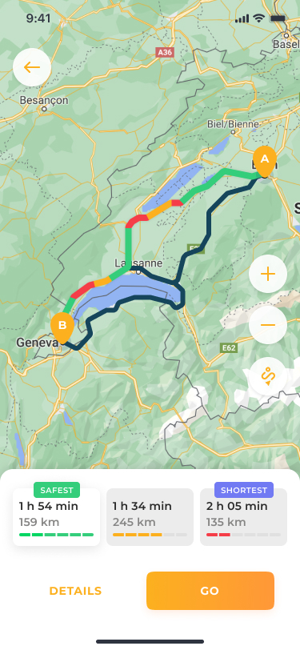
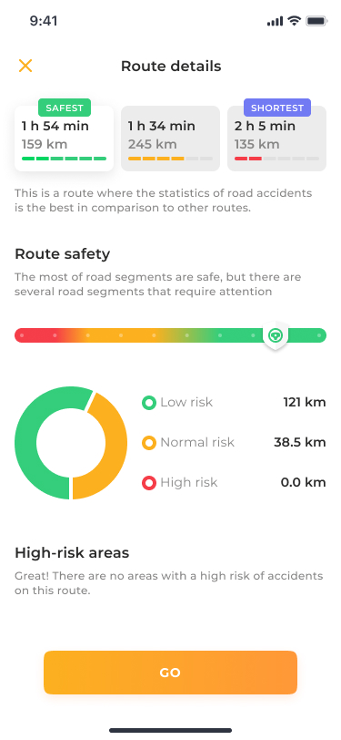

# Kasko2go Open source telematic app for Android
## _Description_
The Kasko2go Open source service is developed to determine a driving behaviour of a certain driver. This telematic service works with digitised road maps, has the information on static and dynamic  accident rate of different road sections.
A driver’s smartphone is used as a client telematic device. An accelerometer and a gyroscope, modules of GPS, GSM and Bluetooth systems embedded into a smartphone turn a driver’s smartphone into a source of telematic information. A mobile application installed on the smartphone transmits telematic data to servers for further processing.

## _Application Functionality:_


| Finding the “optimal route” between the start and end points of the trip  | Provides information about route safety |
| :-------------: | :-------------: |
|   |   |
| Evaluation of risk (probability) of causing an accident by a driver | Collection and primary processing of telemetry data on vehicle movement |
|   |   |

<br/>

This free of charge app can be used to create your own app for Android.

## Get started

To work with the Open source project you need to receive the access to our repositories on [Github][git] that contain source codes and technical documentation of the project.
Provide our [Technical Support Service][TSS] with the information about your Github user account ([Github][git] e-mail address) and receive the following access parameters:
- USER - account username;
- PASSWORD - user account password;
- NAVIGATOR_URL - navigation service address URL. 


<br/>

## Telematic data

1. Find the sdk-telemetry/keystore.properties file in the form given below in the source code repository:
```
1 WEB_API="https://scoring-api.kasko2go.net/api/"
2 RECEIVER="receiver.kasko2go.net"
```

2. Add the lines with access parameters received from out Technical Support Service to the end of the sdk-telemetry/keystore.properties file on Step 1. 
<br/> sdk-telemetry/keystore.properties file takes the following form: 

```
1 WEB_API="https://scoring-api.kasko2go.net/api/"
2 RECEIVER="receiver.kasko2go.net"
3
4 USER="<user_name>"
5 PASSWORD="<user_password>"
6 NAVIGATOR_URL="<https://navigation_url.host.com/>"
```


## Cartography service
1. To work with Google autocomplete service receive an API key for the Maps SDK for Android. The procedure for receiving the key is described in [Using API Keys][UAPIK].
Specify the received Google API key for the Maps SDK for Android in sdk-telemetry/keystore.properties file, which takes the following form:
```
1 WEB_API="https://scoring-api.kasko2go.net/api/"
2 RECEIVER="receiver.kasko2go.net"
3
4 GOOGLE_API_KEY="<api_key>"
5 USER="<user_name>"
6 PASSWORD="<user_password>"
7 NAVIGATOR_URL="<https://navigation_url.host.com/>"
```

2. To work with Google maps services receive a Google Maps API key. The procedure for receiving the key is described in [Maps SDK for Android Quickstart][MSDK].
Specify the received Google Maps API key in app/src/main/AndroidManifest.xml file in the following form:
```
1 <meta-data
2    android:name="com.google.android.geo.API_KEY"
3    android:value="<key>" />
```


## Firebase services

Provide interaction of your Android application with Firebase services. For this add the google-services.json configuration file to your mobile application. Follow [this link for][FB] the procedure of adding the google-services.json configuration file to your mobile application. 


 
 
 [git]: <https://github.com/>
 [TSS]: <mailto:info@kasko2go.com>
 [UAPIK]: <https://developers.google.com/maps/documentation/android-sdk/get-api-key>
 [MSDK]: <https://developers.google.com/maps/documentation/android-sdk/start>
 [FB]: <https://firebase.google.com/docs/android/setup#add-config-file>
 
